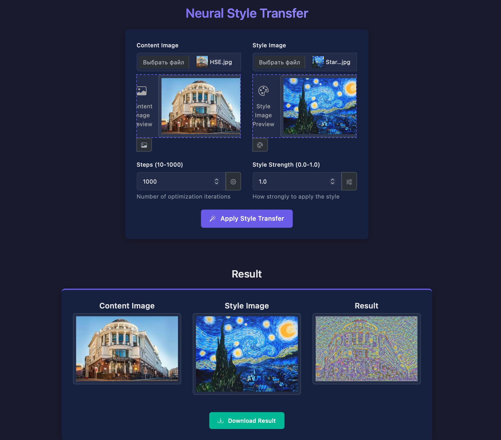
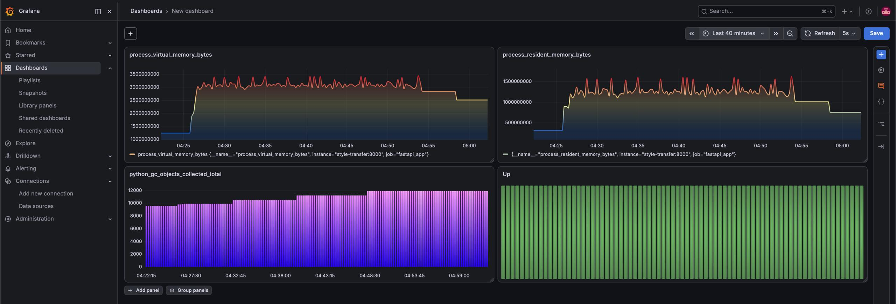
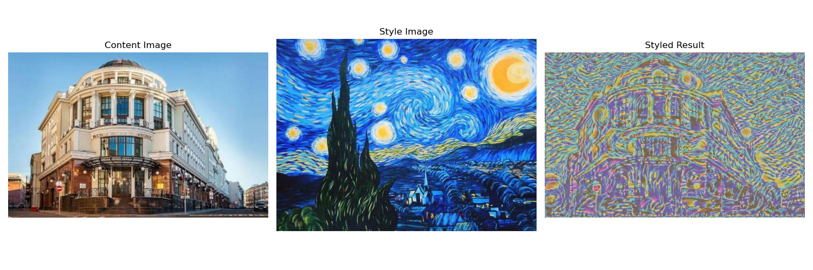
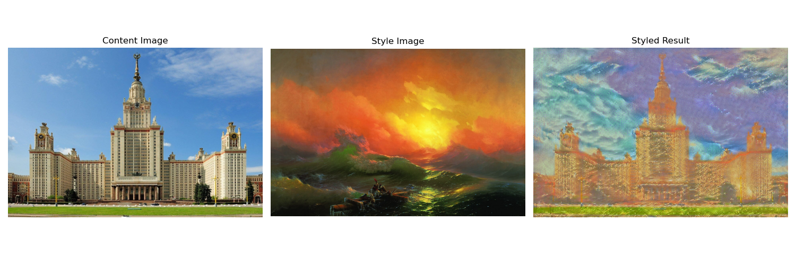
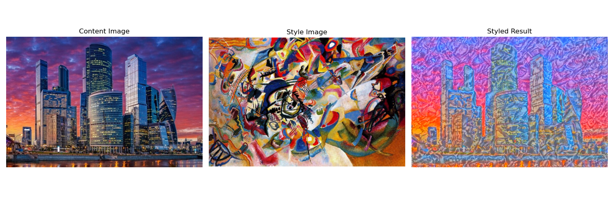
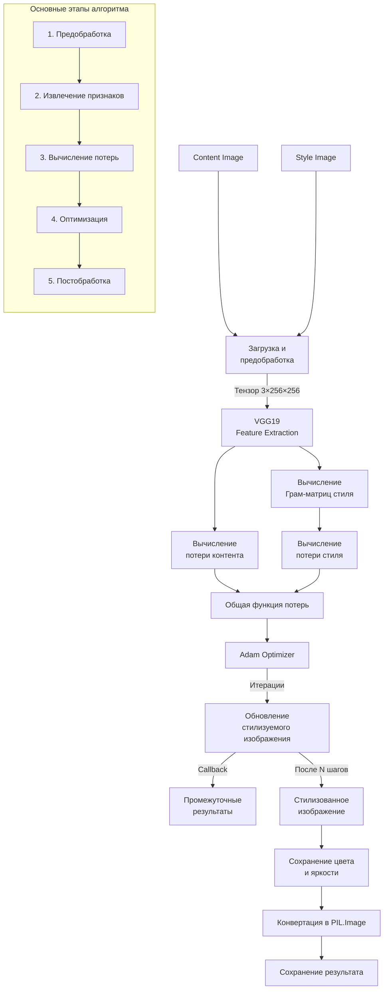
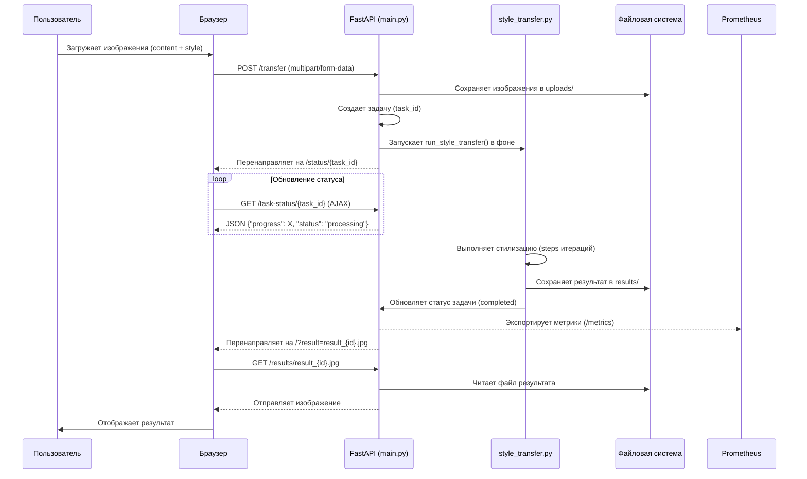
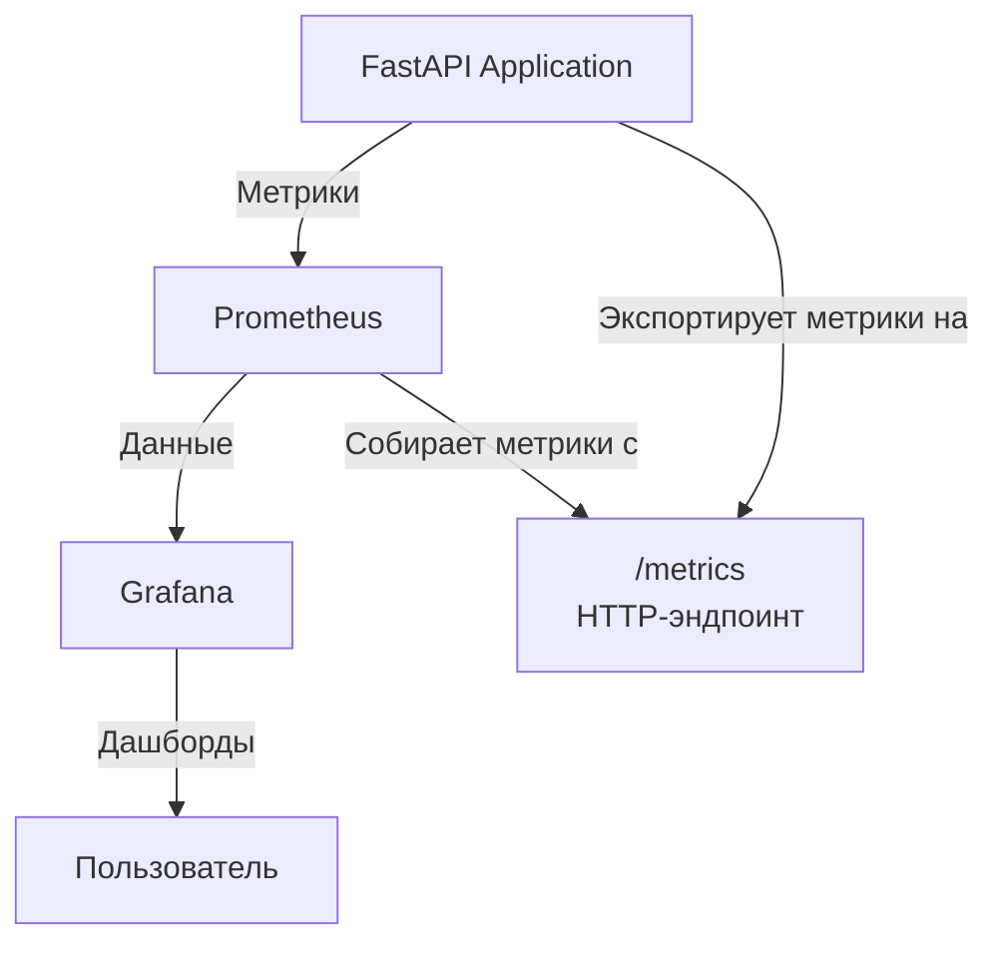

# Image neural style transfer
In this project, I built a deep neural network model that transfers the style of one image to another.
Project realises an algorithm described in article 
"A Neural Algorithm of Artistic Style" (https://arxiv.org/abs/1508.06576)

## Usage instruction

To run with MPS or CUDA support: 
```Bash
git clone https://github.com/BondusS/Image-neural-style-transfer.git
cd Image-neural-style-transfer
pip install -r requirements.txt
uvicorn main:app --reload --host 0.0.0.0 --port 8000
docker-compose up -d --build prometheus grafana
```

Run with docker (CPU only support):
```Bash
git clone https://github.com/BondusS/Image-neural-style-transfer.git
cd Image-neural-style-transfer
docker-compose up --build
```

## Services available
* `Main application` - http://127.0.0.1:8000 (to use application go here)
* `Grafana` - http://127.0.0.1:3000 (resources usage dashboard)
* `Prometheus` - http://127.0.0.1:9090
* `Fastapi endpoints` - http://127.0.0.1:8000/docs

## Application preview


## Dashboard sample


## Samples of use





## Application architecture

### 1. Project structure
```
.
├── main.py                # FastAPI application
├── style_transfer.py      # Neural style transfer implementation with MPS support
├── templates/             # HTML-templates Jinja2
│   ├── index.html         # HTML template of main page
│   ├── status.html        # HTML template of task status page
│   └── error.html         # HTML template of error page
├── static/
│   ├── css/
│   │   ├── style.css      # Main CSS styles
│   │   └── preview.css    # Styles for images preview
│   └── js/                
│       └── preview.js     # Script for images preview
├── uploads/               # Uploaded images (created at runtime)
├── results/               # Result images (created at runtime)
├── tasks/                 # Task statuses in JSON format (created at runtime)
├── __pycache__/           # Python cache (created at runtime)
├── requirements.txt       # Python dependencies
├── Dockerfile             # Docker configuration
├── docker-compose.yml     # Docker Compose configuration
├── .dockerignore          # List of objects to exclude from Docker image
├── .gitignore             # List of objects to exclude from Git
├── prometheus.yml         # Prometheus configuration for metrics collection
└── README.md              # Project documentation
```

### 2. Schema of `main.py` (FastAPI)

```mermaid
%% main.py - FastAPI Neural Style Transfer Service
flowchart TD
    %% Основные компоненты
    A[FastAPI App] --> B[Настройка]
    A --> C[Маршруты]
    A --> D[Фоновые задачи]
    A --> E[Мониторинг]

    %% Настройка
    B --> B1[Статические файлы]
    B --> B2[Шаблоны Jinja2]
    B --> B3[Директории: uploads, results, tasks]
    B --> B4[Логирование]

    %% Маршруты
    C --> C1["GET /"]
    C --> C2["POST /transfer"]
    C --> C3["GET /status/{task_id}"]
    C --> C4["GET /task-status/{task_id}"]
    C --> C5["GET /results/{file_path}"]
    C --> C6["GET /uploads/{file_path}"]
    C --> C7["GET /metrics"]

    %% Описание маршрутов
    C1 -->|"Главная страница с формой\nили результатом"| C1a[Шаблон index.html]
    C2 -->|"Запуск стилизации\nв фоне"| C2a[run_style_transfer]
    C3 -->|"Страница статуса задачи"| C3a[Шаблон status.html]
    C4 -->|"API статус задачи"| C4a[JSON]
    C5 -->|"Файл результата"| C5a[FileResponse]
    C6 -->|"Загруженные файлы"| C6a[FileResponse]
    C7 -->|"Экспорт метрик для Prometheus"| C7a[Prometheus Client]

    %% Фоновые задачи
    D --> D1[run_style_transfer]
    D1 --> D1a[HighQualityStyleTransfer]
    D1 --> D1b[Обновление статуса задачи]
    D1 --> D1c[Сохранение результата]
    D1 --> D1d[Экспорт метрик задач]

    %% Мониторинг
    E --> E1[Prometheus Client]
    E1 --> E2[Метрики задач стилизации]
    E1 --> E3[Метрики использования ресурсов]
```


### 3. Schema of `style_transfer.py`


### 4. Data flow


### 5. Monitoring Architecture

