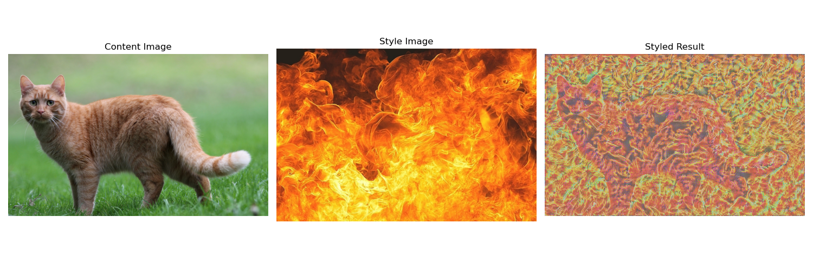

# Image neural style transfer
In this project, I built a deep neural network model that transfers the style of one image to another.
Project realises an algorithm described in article 
"A Neural Algorithm of Artistic Style" (https://arxiv.org/abs/1508.06576)

## Usage instruction
```Bash
git clone https://github.com/BondusS/Image-neural-style-transfer.git
cd Image-neural-style-transfer
pip install -r requirements.txt
# Tune params and image links in style_transfer.py
python style_transfer.py
```

## Samples of use




## Explanation of the algorithm
The model is built with using of transfer learning based on layers of architecture VGG19 pretrained on imagenet pictures.
These layers are used to get representations of the content and style of the image.
In the architecture used, the initial layers define the basic images, 
and the following layers drill down and define finer details

Computation of the Gram matrix for a given tensor, that representing activations from a neural network, 
is used to estimate textures and style of an image.
By comparing the Gram matrices of the source style and the target image, 
we can evaluate how well the target image matches the style of the source image.

Style transfer is accomplished by using a modified gradient optimization method Adam, 
minimizing the MSE loss function, which defines the difference between the current state and the target style.
Computation of loss function also uses regularisation with image total variation, 
which helps to fix an artefacts when long-time algorithm using.
